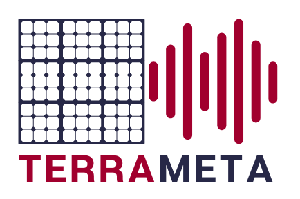
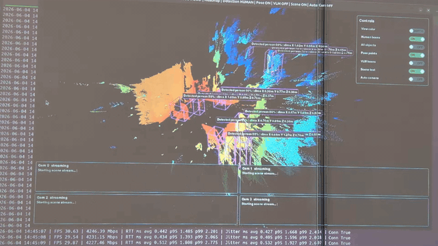
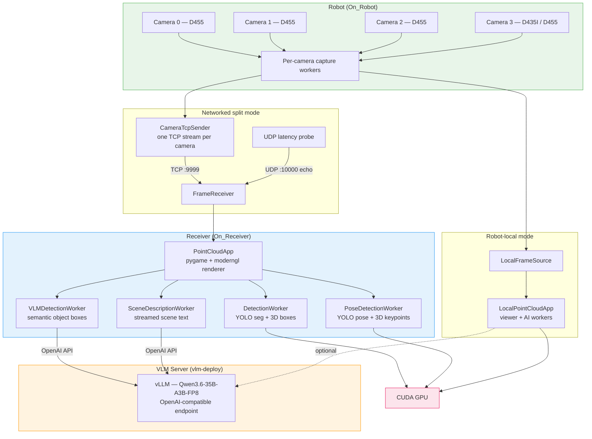

<p align="center">
  
</p>

# TerraMeta Robot Use Case Demo

Real-time multi-camera RealSense capture, 3D point-cloud visualization, and optional AI overlays for a robot platform.

Key capabilities:

- Live 3D point-cloud rendering from four aligned depth + RGB cameras
- Real-time YOLO segmentation with metric 3D bounding boxes fitted from depth
- YOLO-pose keypoint estimation projected into 3D space
- VLM-powered semantic object detection and streamed scene descriptions
- Low-latency networked streaming with UDP probe-based jitter metrics
- Runs fully on-robot or split across robot + receiver

This project supports two ways to run the demo:

- **Networked split mode**: `On_Robot/sender.py` captures frames on the robot and streams them to `On_Receiver/receiver.py` on another machine.
- **Robot-local mode**: `On_Robot/local_ai_viewer.py` captures frames, renders the point cloud, and runs all AI features on the robot itself. No receiver process or frame transmission is used.

## Demo



The demo shows the point-cloud viewer with live YOLO detection boxes, pose skeletons, and VLM scene-description overlays across the four-camera feed. The full-quality video is available at [`assets/demo.mp4`](assets/demo.mp4).

## Architecture



### Networked split mode

```text
On_Robot/sender.py                    On_Receiver/receiver.py
4x RealSense cameras                  pygame + moderngl viewer
independent capture workers     ->    TCP frame receiver
one TCP stream per camera             YOLO boxes, pose, VLM boxes, scene text
UDP latency probe                     GUI controls and metrics
```

### Robot-local mode

```text
On_Robot/local_ai_viewer.py
4x RealSense cameras
local capture workers
FrameReceiver-compatible local source
reused On_Receiver viewer and AI workers
no TCP frame streams and no UDP latency probe
```

## Project Structure

```text
On_Robot/
  sender.py             Networked robot-side RealSense sender
  local_ai_viewer.py    Robot-local viewer and AI runner
  requirements.txt      RealSense capture dependencies
  README.md             Robot setup and run instructions

On_Receiver/
  receiver.py           Network receiver, GUI, point cloud renderer, AI workers
  vlm_scene_describer.py
  vlm_detector.py
  yolo_detector.py
  yolo_pose_detector.py
  requirements.txt      GUI, YOLO, VLM client dependencies
  README.md             Receiver and AI feature docs

vlm-deploy/
  compose.yaml          vLLM OpenAI-compatible server
  Dockerfile
  scripts/
  README.md             VLM deployment docs
```

## Requirements

### Operating system

This project is designed for **Linux**. The sender and TSN tools depend on the
RealSense SDK, `ptp4l`, and `iptables` — all Linux-native. The receiver/viewer
needs an OpenGL 3.3+ capable GPU and a display.

### Hardware

Requirements depend on which role each machine plays. In **robot-local mode**
one machine handles everything; in **networked split mode** the robot (sender)
and receiver are separate machines, and the VLM server can run on either or
a third machine.

#### Sender robot (capture + streaming only)

No GPU needed — the sender only captures RealSense frames and streams them over TCP.

| Component | Minimum | Recommended |
|-----------|---------|-------------|
| CPU | 4 cores | 8+ cores |
| RAM | 4 GB | 8 GB |
| Cameras | 1× Intel RealSense D455 | 4× (see camera table below) |
| Network | Gigabit Ethernet | 10 GbE with TSN/PTP for lowest jitter |

#### Receiver / local viewer (point-cloud rendering + YOLO AI features)

A CUDA GPU is required here — YOLO detection and pose run on `cuda:0` with FP16
and do not silently fall back to CPU. Without VLM, 4 GB VRAM is enough for the
nano models. If you also want VLM features and run the **vLLM server on the same
machine**, the GPU needs enough VRAM for both YOLO and the VLM model
(see VLM server row below).

| Component | Without VLM | With local VLM server |
|-----------|-------------|-----------------------|
| GPU VRAM | 4 GB (e.g. RTX 3050) | 80–128 GB (e.g. A100 80 GB / DGX Spark) |
| RAM | 8 GB | 16 GB |
| Display | 1600×900, OpenGL 3.3+ | 1920×1080 or larger |

The VRAM in the "With local VLM" column covers both the YOLO models and the
FP8 Qwen3.6-35B-A3B weights simultaneously. If the VLM server runs on a
**separate machine**, the receiver's own VRAM requirement drops back to 4 GB.

#### VLM server (vLLM — optional)

Only needed if you use VLM object detection or scene description features.

| Component | Minimum | Recommended |
|-----------|---------|-------------|
| GPU VRAM | 40 GB (FP8 weights fit in 40 GB A100) | 80–128 GB for comfortable concurrency |
| RAM | 32 GB | 64 GB+ |

The VLM server can share a GPU with the receiver when the card has enough VRAM
(set `GPU_MEMORY_UTILIZATION=0.60` to leave room for YOLO). On a dedicated card
you can raise the utilization. See [vlm-deploy/README.md](vlm-deploy/README.md)
for details.

### Software

| Software | Version |
|----------|---------|
| Python | 3.10+ |
| CUDA toolkit | 12.x (matches PyTorch wheel) |
| librealsense2 | 2.57+ (system package or SDK build) |
| Docker (VLM only) | 24+ with NVIDIA Container Toolkit |
| linuxptp (TSN only) | `ptp4l` + `phc2sys` packages |

Key Python dependencies (see [`On_Robot/requirements.txt`](On_Robot/requirements.txt)
and [`On_Receiver/requirements.txt`](On_Receiver/requirements.txt)):

- `pyrealsense2` — RealSense camera capture
- `pygame` + `moderngl` — window, input, and OpenGL rendering
- `ultralytics` — YOLO segmentation and pose models
- `opencv-python-headless` — image resize for VLM requests
- `openai` — OpenAI-compatible VLM client
- `numpy` — array processing

YOLO models (`yolo11n-seg.pt`, `yolo11n-pose.pt`) are **auto-downloaded** from
the Ultralytics hub on first use — no manual weight download is needed.

## Camera Configuration

| Camera | Model | Position | Stream |
|--------|-------|----------|--------|
| 0 | Intel D455 | Front/back configured in code | 1280x720 depth + RGB at 30 fps |
| 1 | Intel D455 | Left | 1280x720 depth + RGB at 30 fps |
| 2 | Intel D455 | Right | 1280x720 depth + RGB at 30 fps |
| 3 | Intel D435I or D455 | Front/back configured in code | 1280x720 depth + RGB at 30 fps |

Camera serial numbers are configured in [On_Robot/sender.py](On_Robot/sender.py).
The local viewer imports the same camera list. Replace the placeholder serials
with the actual serial numbers from your devices.

Find connected serials with:

```bash
python3 -c "import pyrealsense2 as rs; [print(d.get_info(rs.camera_info.serial_number)) for d in rs.context().query_devices()]"
```

## Quick Start

### 1. Clone and create a virtual environment

```bash
git clone <repo-url> terrameta_robot_uc_demo
cd terrameta_robot_uc_demo
python3 -m venv venv
source venv/bin/activate
```

### 2. Configure your camera serials

Open [`On_Robot/sender.py`](On_Robot/sender.py) and replace the four
`REPLACE_WITH_SERIAL_*` placeholder values with the serial numbers printed
by the discovery command in [Camera Configuration](#camera-configuration)
above. If you have fewer than four cameras, comment out the unused entries.

### Option A: Robot-local all-in-one

Use this when the robot has the GPU and display needed for the viewer and AI
models. Everything runs in a single process on one machine.

```bash
pip install -r On_Robot/requirements.txt
python3 On_Robot/local_ai_viewer.py
```

You should see a 1600×900 window showing the live 3D point cloud. Toggle AI
overlays with the keyboard shortcuts or the on-screen control panel (see
[GUI Controls](#gui-controls) below).

`On_Robot/requirements.txt` includes the receiver GUI/AI requirements because
the local viewer reuses that code in-process.

### Option B: Networked robot and receiver

Use this when the robot cannot run the viewer locally — for example, the robot
has cameras but no display or GPU. The sender runs on the robot; the receiver
runs on a separate GPU machine.

**On the receiver/GPU machine:**

```bash
cd On_Receiver
pip install -r requirements.txt
python3 receiver.py
```

The receiver listens on port 9999 and opens the viewer window.

**On the robot:**

```bash
cd On_Robot
pip install -r requirements.txt
python3 sender.py
```

By default the sender connects to `127.0.0.1:9999`. If the receiver runs on
a different machine, edit `SERVER_HOST` in [On_Robot/sender.py](On_Robot/sender.py)
to point at the receiver's IP address, or `SERVER_PORT` in
[On_Receiver/receiver.py](On_Receiver/receiver.py) if your port differs.

### 3. (Optional) Start the VLM server for AI features

VLM object detection and scene description require the vLLM server. Follow
the [vlm-deploy/README.md](vlm-deploy/README.md) to build and start it:

```bash
cd vlm-deploy
cp .env.example .env          # edit if needed
./scripts/build.sh            # downloads model, builds Docker image
docker compose up -d          # starts vLLM on port 8000
```

Once the server is running, toggle VLM features in the viewer with the **V**
key (object boxes) and **L** key (scene descriptions).

If the VLM server runs on a different machine, set it in the environment:

```bash
export VLM_BASE_URL="http://<vlm-host>:8000/v1"
```

## GUI Controls

| Key / Action | Description |
|--------------|-------------|
| W/A/S/D | Move forward/left/back/right |
| Q/E | Move down/up |
| Left mouse drag | Look around |
| Scroll wheel | Zoom |
| T | Toggle depth heatmap / RGB point colours |
| H | Toggle human YOLO boxes |
| O | Toggle all YOLO/COCO object boxes |
| P | Toggle pose points and skeletons |
| V | Toggle VLM semantic object boxes |
| L | Toggle streamed VLM scene text |
| Click GUI switches | Toggle the same features from the control panel |
| Escape | Quit |

## AI Features

- **YOLO segmentation boxes**: runs a resident YOLO segmentation model, then fits metric 3D boxes from aligned depth.
- **All-object YOLO mode**: uses the same segmentation model without the person-only filter.
- **Pose estimation**: runs YOLO pose and projects valid keypoints into 3D.
- **VLM object boxes**: sends low-rate OpenAI-compatible image requests to vLLM for semantic box localization, then uses depth for 3D dimensions.
- **VLM scene text**: sends one streamed scene-description request per camera and renders the token stream in GUI text panels.

The YOLO and pose paths default to CUDA. They intentionally do not silently fall back to CPU.

## VLM Server

VLM features require an OpenAI-compatible vision endpoint. The included [vlm-deploy](vlm-deploy) folder starts a vLLM server using FP8 weights from `Qwen/Qwen3.6-35B-A3B-FP8`, with defaults tuned for a high-memory GPU system:

- `GPU_MEMORY_UTILIZATION=0.60`
- `MAX_MODEL_LEN=4096`
- `MAX_NUM_SEQS=8`
- one image per request
- non-thinking chat-template defaults

Receiver and local-viewer code use:

```python
VLM_BASE_URL = "http://127.0.0.1:8000/v1"
VLM_MODEL = "qwen3.6-35b-a3b"
```

Set `VLM_BASE_URL` in the environment if the VLM server runs on a different machine.

## Metrics

Networked mode logs render FPS, frame-stream bitrate, and UDP probe latency/jitter. It also appends 30-second network metric windows to `On_Receiver/receiver_30s_metrics.csv`.

Robot-local mode logs local capture FPS and active camera IDs. Network bitrate and UDP latency metrics are not used because no frame transmission occurs.

## TSN/PTP Probe Network Profile

The [tools](tools) folder includes simple on/off scripts for a low-jitter UDP probe profile on ConnectX-style Linux Ethernet interfaces. The default `probe` profile is probe-first: it marks UDP port `10000` with DSCP 46, maps it to priority 6, gives that priority its own `mqprio` transmit queue, reduces interrupt coalescing, disables global pause, enables high-quality PTP TX timestamps when supported, applies host low-latency sysctls, and starts PTP/IEEE 1588 with `ptp4l` plus `phc2sys` when possible. It saves a restore point under `/var/tmp/terrameta_tsn/`.

Use the active ConnectX Ethernet interface on both ends. Pass it as the first argument or set the `TM_NET_IFACE` environment variable.

```bash
# Preview without changing anything
python3 tools/tsn_probe_profile.py apply --iface eth0 --dry-run

# Turn the profile on/off
tools/tsn_on.sh eth0
tools/tsn_status.sh eth0
tools/tsn_off.sh eth0
```

The scripts need `sudo` for apply/restore and will preserve the first restore point unless `--replace-state` is passed. Use `--keep-pause` with `tsn_on.sh` if the switch fabric depends on Ethernet pause behavior, and `--no-ptp` if you only want QoS without PTP. See [tools/README.md](tools/README.md) for the full behavior and options.

## Notes

- Depth is aligned to RGB in the RealSense capture path so 2D detections sample matching depth pixels.
- Both modes keep the newest per-camera frame and do not wait for synchronized four-camera bundles.
- Camera extrinsics and max depths are configured in [On_Receiver/receiver.py](On_Receiver/receiver.py), and are reused by the robot-local viewer.
- The viewer window is 1600×900 and requires an OpenGL 3.3+ core-profile context.

## License

This project is licensed under the [MIT License](LICENSE).
