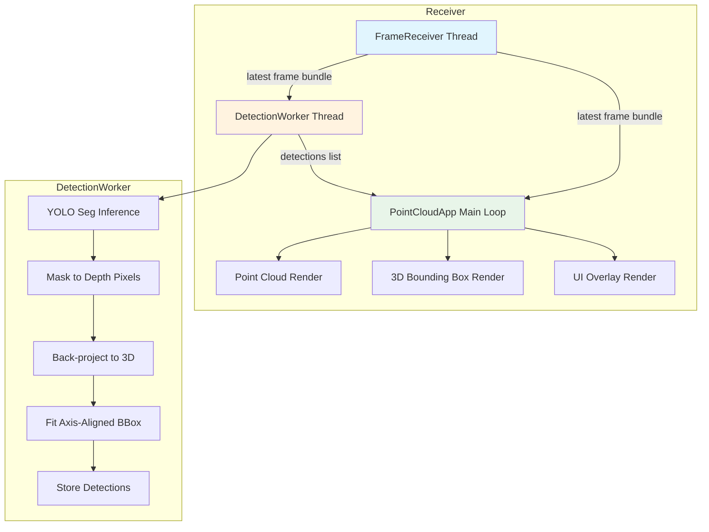

# YOLO Human Detection Pipeline — Implementation Plan

## 1. Codebase Analysis Summary

### Existing Architecture

```
On_Robot/sender.py                          On_Receiver/receiver.py
┌─────────────────────┐                     ┌──────────────────────────────────┐
│ 4x RealSense cams    │    TCP pickle      │  FrameReceiver thread            │
│ depth z16 + color rgb8│ ────────────────► │  ↓ pop_latest_frame()           │
│ 1280x720 @ 30fps     │                    │  PointCloudApp main loop         │
│                      │                    │  ├─ pygame event handling        │
│ No depth-color       │                    │  ├─ moderngl point cloud render  │
│ alignment done       │                    │  │   (vertex shader deprojects   │
│                      │                    │  │    depth→3D using intrinsics) │
└─────────────────────┘                     │  └─ UI toggle button            │
                                            └──────────────────────────────────┘
```

### Key Findings

| Aspect | Detail |
|--------|--------|
| **Frame format** | Tuple of numpy arrays: `[depth0(z16), color0(rgb8), depth1, color1, ...]` |
| **Camera count** | 3 or 4 cameras supported |
| **Resolution** | 1280x720 @ 30fps per camera |
| **Depth-color alignment** | NOT aligned on sender side; raw depth + raw color sent |
| **Intrinsics** | Approximate, derived from FOV constants on receiver |
| **Coordinate convention** | OpenGL right-handed: X-right, Y-up, Z-backward; vertex shader negates Y for depth→world |
| **Rendering** | moderngl point cloud with jet heatmap or RGB coloring |
| **Threading** | FrameReceiver daemon thread + main render loop thread |
| **Dependencies** | numpy, moderngl, pygame (no pyrealsense2 on receiver) |

### Critical Design Constraint

The sender transmits **raw unaligned** depth and color frames. Both are 1280x720 from the same camera module, so they are approximately spatially co-registered. The parallax between depth and color sensors on D455/D435I is small (~10-30px at 1-3m). For bounding-box-level accuracy, this approximation is acceptable. If higher precision is needed later, the sender can be modified to include aligned depth.

---

## 2. Architecture Overview



### Data Flow

```
FrameBundle (depth + color per camera)
    │
    ├──► PointCloudApp._upload_frame_bundle()  [existing, unchanged]
    │
    └──► DetectionWorker.process_frame()
            │
            ├── Select camera(s) for detection
            ├── Run YOLO-seg on color image
            ├── For each person detection:
            │     ├── Extract mask pixels
            │     ├── Sample depth values under mask
            │     ├── Filter invalid/outlier depths
            │     ├── Back-project to 3D points
            │     └── Fit axis-aligned bounding box
            └── Store List[PersonBBox3D]
                    │
                    └──► PointCloudApp._render_bounding_boxes()
                            └── Draw wireframe boxes via GL_LINES
```

---

## 3. Module Design

### 3.1 `yolo_detector.py` — YOLO Segmentation Detector

**Purpose:** Wraps Ultralytics YOLO segmentation model for person-only detection.

```python
@dataclass
class Detection2D:
    camera_id: int
    class_id: int          # COCO class id (0 = person)
    label: str             # "person"
    confidence: float
    bbox_xyxy: np.ndarray  # [x1, y1, x2, y2] in pixel coords
    mask: np.ndarray       # binary mask H x W (bool)
    frame_timestamp: float # time.time() when frame was captured


class YoloSegPersonDetector:
    def __init__(
        self,
        model_path: str = "yolo11n-seg.pt",
        conf_threshold: float = 0.5,
        iou_threshold: float = 0.45,
        imgsz: int = 640,
        device: str = "",        # "" = auto, "cuda:0", "cpu"
        half_precision: bool = True,
        target_class_id: int = 0,  # COCO person
    ):
        ...

    def detect(self, color_image: np.ndarray, camera_id: int) -> List[Detection2D]:
        """Run YOLO-seg on a single RGB image, return person detections."""
        ...
```

**Key details:**
- Uses `ultralytics.YOLO(model_path)` with `retina_masks=True` for high-res masks
- Filters results to `target_class_id` only
- Returns empty list if no persons found
- Model loaded once in `__init__`, reused across frames
- Supports TensorRT/ONNX paths via model_path parameter

### 3.2 `depth_to_3d.py` — Mask-to-3D Conversion & BBox Fitting

**Purpose:** Converts 2D YOLO masks + depth into 3D axis-aligned bounding boxes.

```python
@dataclass
class PersonBBox3D:
    camera_id: int
    center_xyz: np.ndarray   # [X, Y, Z] in metres, world coords after rotation+offset
    size_xyz: np.ndarray     # [width, height, depth] in metres
    confidence: float
    label: str               # "person"
    num_points: int          # number of valid depth points used
    timestamp: float
```

**Algorithm per detection:**

1. **Resize mask** to match depth resolution if needed (both 1280x720, so usually no-op).
2. **Extract depth pixels** where mask == True.
3. **Filter invalid depths:** remove 0, NaN, values > MAX_DEPTH_METERS.
4. **Erode mask** optionally (morphological erosion, kernel size configurable) to reduce edge leakage.
5. **Subsample** mask pixels for speed (every Nth pixel, max M points total).
6. **Compute median depth** for robustness.
7. **Reject outliers:** keep points within ±0.5m of median.
8. **Back-project** surviving pixels to 3D using intrinsics:
   ```
   X = (u - cx) * Z / fx
   Y = -(v - cy) * Z / fy   # negate Y to match OpenGL convention
   Z = depth_m
   ```
9. **Apply camera rotation + offset** to transform from camera-local to world coordinates:
   ```
   world_pos = CAMERA_ROTATIONS[i] @ local_pos + CAMERA_OFFSETS[i]
   ```
10. **Fit axis-aligned bounding box:** compute min/max along each axis from the 3D points, derive center and size.

```python
def fit_person_bbox(
    depth_image: np.ndarray,
    mask: np.ndarray,
    camera_id: int,
    fx: float, fy: float, cx: float, cy: float,
    max_depth_m: float = 10.0,
    erosion_kernel: int = 3,
    subsample_step: int = 2,
    outlier_threshold_m: float = 0.6,
    min_points: int = 10,
) -> Optional[PersonBBox3D]:
    ...
```

### 3.3 `bbox_renderer.py` — 3D Wireframe Bounding Box Renderer

**Purpose:** Draws 3D axis-aligned bounding boxes as wireframe cubes in the scene.

Uses a separate moderngl shader program with `GL_LINES` primitive type.

**Shader approach:**
- Vertex shader takes 3D box corner positions (8 corners × 12 edges = 24 vertices)
- Transforms through the same view/projection matrices used by the point cloud
- Fragment shader outputs a solid color (green/cyan for detected persons)
- Each box rendered as 12 line segments (wireframe cube)

```python
class BBoxRenderer:
    def __init__(self, ctx: moderngl.Context):
        self._ctx = ctx
        self._program = None  # line shader
        self._vbo = None
        self._vao = None
        self._color_uniform = None
        self._view_uniform = None
        self._projection_uniform = None

    def update_boxes(self, boxes: List[PersonBBox3D]) -> None:
        """Rebuild VBO with current set of 3D bounding boxes."""
        ...

    def render(self, view_matrix: np.ndarray, projection_matrix: np.ndarray) -> None:
        """Draw all bounding boxes."""
        ...
```

**Wireframe cube geometry:** For each box, generate 12 edges (24 vertices):
```
Corners: (cx±w/2, cy±h/2, cz±d/2) — 8 corners
Edges: connect each pair of adjacent corners — 12 edges
```

### 3.4 Integration into `receiver.py`

#### New constants (at top of file):

```python
# Human detection settings
DETECTION_ENABLED = False          # Default off, toggle with 'H' key
DETECTION_MODEL_PATH = "yolo11n-seg.pt"
DETECTION_CONF_THRESHOLD = 0.5
DETECTION_IOU_THRESHOLD = 0.45
DETECTION_IMGSZ = 640
DETECTION_DEVICE = ""              # "" = auto
DETECTION_HALF_PRECISION = True
DETECTION_CAMERAS = (0,)           # Which cameras to run detection on
DETECTION_EROSION_KERNEL = 3
DETECTION_SUBSAMPLE_STEP = 2
DETECTION_OUTLIER_THRESHOLD_M = 0.6
DETECTION_MIN_POINTS = 10
BBOX_COLOR = (0.0, 1.0, 0.5, 1.0)  # Green-cyan wireframe
```

#### New key binding:

| Key | Action |
|-----|--------|
| H | Toggle human detection on/off |

#### Modified `PointCloudApp.__init__`:

Add fields:
```python
self._detection_enabled = DETECTION_ENABLED
self._detector: Optional[YoloSegPersonDetector] = None
self._bbox_renderer: Optional[BBoxRenderer] = None
self._detection_worker: Optional[DetectionWorker] = None
self._latest_detections: List[PersonBBox3D] = []
self._detection_lock = threading.Lock()
```

#### New `DetectionWorker` class:

A daemon thread that continuously processes the latest frame bundle:

```python
class DetectionWorker(threading.Thread):
    def __init__(self, detector, stop_event, detection_lock, ...):
        super().__init__(name="DetectionWorker", daemon=True)
        ...

    def run(self):
        while not self._stop_event.is_set():
            frame_bundle = self._receiver.pop_latest_frame()
            if frame_bundle is None:
                time.sleep(0.01)
                continue
            # Process each configured camera
            for cam_idx in self._detection_cameras:
                color = frame_bundle[cam_idx * 2 + 1]
                depth = frame_bundle[cam_idx * 2]
                detections_2d = self._detector.detect(color, cam_idx)
                bboxes_3d = []
                for det in detections_2d:
                    bbox = fit_person_bbox(depth, det.mask, ...)
                    if bbox is not None:
                        bboxes_3d.append(bbox)
                with self._detection_lock:
                    self._latest_detections = bboxes_3d
```

**Important threading consideration:** The `pop_latest_frame()` method consumes the frame (sets it to None). Currently the main render loop calls it. We need to change this so that:
- The detection worker gets its own copy of the frame (or uses a different mechanism)
- The main render loop still gets frames for rendering

**Solution:** Change `_store_frame` to keep the latest frame available without consuming it. Add a method like `peek_latest_frame()` that returns the frame without clearing it. Or better yet, make the detection worker read from a shared buffer that doesn't consume the frame.

Actually, looking more carefully at the code, `pop_latest_frame()` sets `_latest_frame = None` after reading. This means only one consumer can read each frame. We need to refactor this slightly:

Option A: Add a `peek_latest_frame()` method that returns the frame without consuming it.
Option B: Have the detection worker share the frame reference (since numpy arrays are immutable once uploaded to GPU, this is safe).

I'll go with Option A — add `peek_latest_frame()` to `FrameReceiver`.

#### Modified render loop:

In `_render_frame()`, after rendering the point cloud, add:
```python
if self._detection_enabled and self._bbox_renderer is not None:
    with self._detection_lock:
        boxes = self._latest_detections
    self._bbox_renderer.update_boxes(boxes)
    self._bbox_renderer.render(view_matrix, projection_matrix)
```

#### Modified `_process_events()`:

Add handler for 'H' key to toggle detection.

#### Modified `_cleanup()`:

Release detection worker, bbox renderer resources.

---

## 4. Implementation Steps (Ordered)

### Step 1: Create `On_Receiver/yolo_detector.py`
- Define `Detection2D` dataclass
- Implement `YoloSegPersonDetector` class
- Load model lazily or eagerly based on config
- Filter to person class only
- Return clean detection list

### Step 2: Create `On_Receiver/depth_to_3d.py`
- Define `PersonBBox3D` dataclass
- Implement `fit_person_bbox()` function
- Handle mask resizing, depth filtering, erosion, subsampling
- Back-project to 3D using intrinsics
- Apply camera rotation + offset
- Fit axis-aligned bounding box from 3D points

### Step 3: Create `On_Receiver/bbox_renderer.py`
- Define `BBoxRenderer` class
- Create line shader program (vertex + fragment)
- Generate wireframe cube geometry from PersonBBox3D
- Build/update VBO with box vertices
- Render with GL_LINES using view/projection matrices

### Step 4: Modify `On_Receiver/receiver.py`
- Add detection configuration constants
- Add `peek_latest_frame()` to `FrameReceiver`
- Add `DetectionWorker` thread class
- Integrate `YoloSegPersonDetector`, `fit_person_bbox`, `BBoxRenderer` into `PointCloudApp`
- Add 'H' key binding to toggle detection
- Add bbox rendering to `_render_frame()`
- Update cleanup logic

### Step 5: Update `On_Receiver/requirements.txt`
- Add `ultralytics>=8.0.0`

### Step 6: Update `On_Receiver/README.md`
- Document new detection mode
- Document 'H' key binding
- Document model download/setup instructions

---

## 5. Performance Considerations

| Concern | Mitigation |
|---------|------------|
| YOLO inference latency | Use `yolo11n-seg.pt` (nano model); enable half precision; consider TensorRT export |
| 4-camera detection cost | Default to 1 camera; configurable per-camera selection |
| Depth processing overhead | Subsample mask pixels (every 2nd/4th); limit max points per detection |
| Thread contention | Lock-free handoff via lock-protected shared variable; detection runs async |
| Memory pressure | Reuse detection buffers; avoid unnecessary copies |
| Rendering overhead | Wireframe boxes are cheap (24 vertices per box × N people) |

---

## 6. Coordinate System Summary

```
Camera-local (depth sensor):
  X = right, Y = down, Z = forward (depth)

After back-projection:
  X = (u - cx) * Z / fx
  Y = -(v - cy) * Z / fy   ← negated to flip Y-up
  Z = depth_m

After camera rotation + offset (per camera):
  world_pos = rotation_matrix @ [X, Y, Z] + offset

OpenGL rendering:
  Same view/projection matrices as point cloud
  Boxes drawn in world coordinates
```

---

## 7. File Structure After Implementation

```
On_Receiver/
├── receiver.py              # Modified — integration of detection pipeline
├── yolo_detector.py         # NEW — YOLO segmentation detector
├── depth_to_3d.py           # NEW — Mask→3D conversion & bbox fitting
├── bbox_renderer.py         # NEW — 3D wireframe bounding box renderer
├── requirements.txt         # Updated — add ultralytics
├── README.md                # Updated — document detection mode
└── receiver_30s_metrics.csv # Existing metrics output
```
